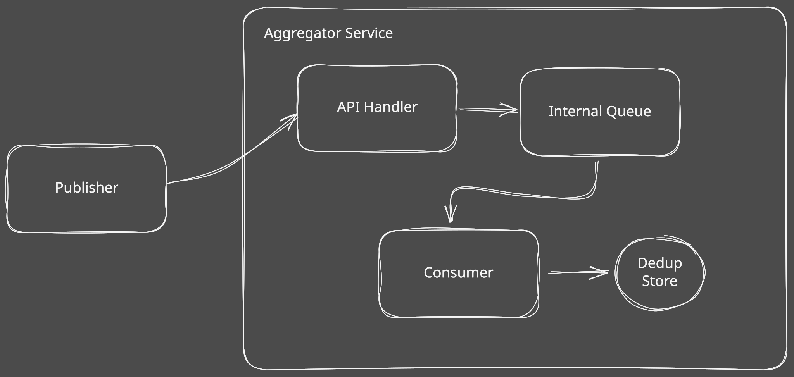

# UTS Sistem Paralel dan Terdistribusi: Pub-Sub Log Aggregator dengan Idempotent Consumer dan Deduplication

- Azhar Rizqullah Fakhri Ismail
- 11221052
- Sistem Paralel dan Terdistribusi B

## Ringkasan Sistem dan Arsitektur

Sistem ini dirancang sebagai layanan log aggregator dengan fokus utama pada _idempotency_ dan _deduplication event_. Arsitektur ini (terlihat pada diagram) secara sengaja memisahkan alur penerimaan (_ingestion_) dari alur pemrosesan (_processing_) untuk menjamin setiap _event_ unik diproses tepat satu kali (_exactly-once processing_), bahkan dalam kondisi pengiriman _at-least-once_.

Alur data dimulai ketika satu atau lebih _publisher_ mengirimkan _event_ (log) dalam bentuk _request_ HTTP ke _endpoint_ API yang diekspos oleh FastAPI.

API handler dari sisi aggregator kemudian menerima request dari publisher, memvalidasinya, kemudian meneruskan eventnya ke queue internal sistem (`asyncio.Queue`). _Queue_ ini bertindak sebagai _broker_ sederhana yang memisahkan logika penerimaan yang cepat dari logika pemrosesan yang mungkin lebih lambat.

Di _background_, sebuah _idempotent consumer_ selalu memeriksa apakah ada _event_ baru yang masuk ke dalam _queue_. Apabila ada, _event_ akan lanjut diproses. Consumer memeriksa kombinasi unik `(topic, event_id)` yang ada di dalam database persisten (yang diimplementasikan menggunakan SQLite). Dari situ, ada dua kemungkinan yang terjadi:
- Kombinasi `(topic, event_id)` ditemukan: Artinya _event_ tersebut adalah duplikat. _Event_ tersebut kemudian di-_drop_, lalu akan dicatat bahwa ditemukan satu duplikat
- Kombinasi `(topic, event_id)` tidak ditemukan: Artinya _event_ tersebut unik. _Event_ akan diproses, dan data _event_ tersebut dicatat di database.

## Keputusan Desain
Inti dari desain sistem ini adalah _consumer_ yang _idempotent_. _Publisher_ diasumsikan beroperasi dengan mengikuti aturan _at-least-once_, artinya _publisher_ akan mengirim ulang _event_ jika terjadi kegagalan jaringan. Untuk mencegah pengiriman ulang ini menyebabkan pemrosesan _event_ duplikat, _consumer_ dirancang agar _idempotent_. Artinya, _event_ yang sama, ketika diproses berkali-kali hanya akan memiliki efek yang sama seperti memprosesnya satu kali.

Untuk mencapai _idempotency_ ini, _deduplication store_ diimplementasikan dengan menggunakan SQLite. Karena sifatnya SQLite yang menyimpan secara persisten dalam bentuk file lokal, SQLite sangat berguna untuk _fault tolerance_, dibanding menggunakan `set` _in-memory_ misalnya. Efeknya, apabila server _aggregator_ di-_restart_, catatan _event-event_ unik yang telah dikirim sebelumnya akan tetap disimpan dengan aman tanpa terhapus. Logika deduplikasi mengandalkan penggunaan _composite primary key_ `(topic, event_id)`, yang menjamin keunikan suatu _event_.

Terkait _ordering_, sistem ini dengan sengaja tidak menjamin _total ordering_. Menerapkan _total ordering_ sangatlah kompleks dan dalam kasus ini, tidak diperlukan. Sistem ini mengandalkan `asyncio.Queue` untuk pengurutan lokal saat penerimaan, dan mengandalkan `timestamp` yang dimiliki oleh setiap _event_ untuk melakukan pengurutan.

## Analisis Performa

Performa sistem dievaluasi dengan membandingkan dua metrik utama untuk pemrosesan *single* (satu per satu) dan *batched* (secara berkelompok):

1.  **Latency (Waktu Tunda)**: Mengukur waktu yang dibutuhkan untuk memproses *event*. Ini dibagi menjadi `Avg Single Latency` (rata-rata waktu untuk satu *event*) dan `Batch Latency` (total waktu untuk memproses satu *batch* berisi "N Events"). Semakin rendah latensi, semakin baik.
2.  **Throughput (Daya Tembus)**: Mengukur jumlah *event* yang dapat diproses per detik. Ini dibagi menjadi `Single Throughput` (jika diproses satu per satu) dan `Batched Throughput` (jika diproses dalam *batch*). Semakin tinggi *throughput*, semakin baik.

Evaluasi ini dilakukan pada empat skenario dengan jumlah *event* (N) yang berbeda: 10, 100, 1.000, dan 10.000.

| N Events | Avg Single Latency | Batch Latency | Single Throughput | Batched Throughput |
|:---|:---|:---|:---|:---|
| 10 | 0.001617s | 0.001140s | 618.51 events/s | 8771.02 events/s |
| 100 | 0.001018s | 0.003269s | 982.20 events/s | 30590.80 events/s |
| 1000 | 0.000928s | 0.024687s | 1077.08 events/s | 40507.46 events/s |
| 10000 | 0.001299s | 0.255028s | 769.82 events/s | 39211.31 events/s |

Berdasarkan tabel, ada dua temuan utama:

1.  Pemrosesan secara *batch* (`Batched Throughput`) secara konsisten menghasilkan *throughput* yang jauh lebih tinggi daripada pemrosesan tunggal (`Single Throughput`). Sebagai contoh, pada N=1000, *throughput batch* (40.507 *events*/s) sekitar 37 kali lebih cepat daripada *throughput* tunggal (1.077 *events*/s).
2.  Kinerja *throughput batch* meningkat tinggi seiring bertambahnya ukuran *batch* dari 10 ke 100, dan mencapai puncaknya pada N=1000 (40.507 *events*/s). Namun, ketika ukuran *batch* dinaikkan menjadi 10.000, *throughput* sedikit menurun (39.211 *events*/s). Ini menunjukkan bahwa ukuran *batch* optimal untuk *throughput* maksimum dalam pengujian ini adalah sekitar 1.000 *event*.

## Keterkaitan ke Bab 1-7

### T1: Karakteristik Utama Sistem Terdistribusi dan Trade-off Umum pada Desain Pub-Sub Log Aggregator
Karakteristik utama dari sistem terdistribusi didefinisikan oleh _design goals_-nya. Salah satu tujuan utamanya adalah _Resource Sharing_, yang membuat pengaksesan dan pembagian sumber daya dari luar ke pengguna dan aplikasi menjadi lebih mudah (Tanenbaum & Van Steen, 2025, hlm. 10). Selain itu, sistem terdistribusi mengupayakan _Distribution Transparent_ dengan berusaha menyembunyikan fakta bahwa proses dan sumber daya tersebar secara fisik dalam beberapa mesin, sehingga distribusinya tidak terlihat atau transparan bagi pengguna (Tanenbaum & Van Steen, 2025, hlm. 11). Karakteristik lainnya adalah _Openness_ (keterbukaan), di mana sistem menawarkan komponen yang dapat dengan mudah digunakan oleh dan diintegrasikan ke sistem-sistem lain (Tanenbaum & Van Steen, 2025, hlm. 15). _Dependability_ juga penting, yang mengarah ke sejauh mana suatu sistem dapat diharapkan untuk beroperasi dengan baik sesuai ekspektasi (Tanenbaum & Van Steen, 2025, hlm. 18). Hal ini terkait erat dengan _Security_ (keamanan), karena sistem yang tidak aman dianggap tidak dapat diandalkan; keamanan melibatkan pemastian kerahasiaan, integritas, serta otorisasi akses dan pengungkapan informasi (Tanenbaum & Van Steen, 2025, hlm. 21). Terakhir, _Scalability_ (skalabilitas) merujuk pada kemampuan sistem untuk menangani peningkatan di beberapa dimensi, yaitu _size scalability_, _geographical scalability_, dan _administrative scalability_.

Salah satu _trade-off_ paling umum untuk suatu desain _pub-sub log aggregator_ adalah konflik antara _consistency, replication,_ dan _performance_. _Replication_ dapat digunakan untuk meningkatkan performa sistem. Namun, dalam waktu yang sama, _replication_ juga dapat menimbulkan konflik dengan konsistensi data. Mempertahankan konsistensi yang kuat antar replika ini memerlukan sinkronisasi global yang sangat mahal, yang dapat menimbulkan kenaikan latensi dan secara ironis menegasi benefit performa dari _replication_ itu sendiri (Tanenbaum & Van Steen, 2025, hlm. 395). 

### T2: Perbandingan Arsitektur _Client-Server_ dengan _Publish-Subscribe_ untuk _Aggregator_
Dalam arsitektur _client-server_ tradisional, proses-proses dibagi menjadi _client_ yang me-_request_ suatu _service_ dan _server_ yang mengimplementasikan itu. Interaksi ini umumnya mengikuti perilaku _synchronous request-reply_, artinya _client_ terblokir dan menunggu untuk respon dari _server_. Untuk suatu _aggregator_ yang memerlukan data dari banyak sumber, _client-server_ modelnya mengharuskan _aggregator_-nya (_client_) untuk _tightly coupled_ dengan setiap sumber data (_server_), sehingga _aggregator_ harus mengetahui secara tepat cara merujuk ke setiap sumber (Tanenbaum & Van Steen, 2025, hlm. 41). Sebaliknya, arsitektur _publish-subscribe_ menekankan separasi yang kuat antara pemrosesan komponen dan mekanisme koordinasi, melihat sistemnya sebagai koleksi proses yang beroperasi secara otonom (Tanenbaum & Van Steen, 2025, hlm. 68). Dalam suatu sistem _pub-sub_, pengirim dan penerima tidak berkomunikasi secara langsung atau bahkan tau satu sama lain. Pengirim sekedar mengirim pesan dan penerima _subscribe_ ke topik tertentu. Sistemnya berlaku sebagai _middle-man_, memastikan pesan nya otomatis dikirim ke semua orang yang mendaftar, tanpa pengirimnya tau siapa yang menerimanya.

Arsitektur _pub-sub_ cocok untuk skenario di mana sistem terdistribusi diharapkan untuk berkembang dari segi ukuran dan kompleksitas, atau ketika beberapa proses dapat secara mudah masuk dan keluar (Tanenbaum & Van Steen, 2025, hlm. 68). Salah satu kelebihan utama dari sistem ini adalah bahwa bagian-bagiannya tidak saling terjerat. Karena komponen tidak perlu saling mengenal, pada dasarnya lebih mudah untuk menambahkan komponen baru, menghapus komponen lama, atau mengembangkan keseluruhan sistem. Pendekatan "terurai" inilah yang membuatnya sangat baik dalam mengelola kompleksitas, memungkinkan Anda membangun sistem masif tanpa menjadi berantakan dan tak terkendali. 

### T3: _At-least-once_ VS _Exactly-once_ _Delivery Semantics_ dan Alasan Mengapa _Idempotent Consumer_ krusial di _presence of retries_.
Permasalahan utama dari secara otomatis me-_retry_ _request_ yang gagal adalah tidak mengetahui mengapa _request_ tersebut gagal. Kita tidak bisa mengetahui apakah pesan kita tidak pernah sampai, atau apabila sampai, konfirmasi sukses dari server tidak sampai kembali ke kita. Apabila kita me-_request_ ulang, terdapat resiko operasi tersebut dilakukan dua kali (Tanenbaum & Van Steen, 2025, hlm. 79). Ketidakpastian ini mendefinisikan perbedaan _delivery guarantees_: semantik _at-least-once_ memastikan bahwa _remote procedure call_-nya dilakukan setidaknya sekali, namun berpotensi lebih dari itu, biasanya dengan meminta _client_ terus mencoba hingga balasan diterima (Tanenbaum & Van Steen, 2025, hlm. 511). Sebaliknya, semantik _exactly-once_ merepresentasikan jaminan ideal namun seringkali tidak mungkin bahwa RPC-nya dieksekusi tepat satu kali  (Tanenbaum & Van Steen, 2025, hlm. 511). Mencapai idealitas ini sulit karena apabila terjadi _server crash_, _client_ tidak dapat mengetahui apakah _crash_ terjadi sebelum atau setelah _server_ menyelesaikan operasi yang diminta.

Sangat penting bagi _consumer_ untuk bersifat _idempotent_ ketika dihadapkan pada percobaan ulang karena operasi yang tidak _idempotent_ akan menyebabkan kerusakan yang tidak dapat diubah atau inkonsistensi jika dieksekuis lebih dari satu kali. Suatu operasi didefinisikan sebagai _idempotent_ apabila operasinya dapat secara aman diulang berulang kali tanpa melakukan kerusakan atau memiliki efek samping yang tidak diperkirakan. Karena sistem terdistribusi yang andal umumnya bergantung pada mekanisme _retry_ ketika komunikasi gagal atau kehabisan waktu, sistem tersebut secara implisit beroperasi dalam kondisi yang menghasilkan setidaknya satu eksekusi. Oleh karena itu, jika operasi yang dilakukan bersifat _idempotent_, sistem terdistribusi dapat secara efektif menutupi kegagalan komunikasi dan tetap memberikan hasil yang benar secara fungsional, meskipun berpotensi mengeksekusi operasi secara berulang-ulang  (Tanenbaum & Van Steen, 2025, hlm. 80).

### T4: Skema Penamaan `topic` dan `event_id` serta Dampaknya terhadap Deduplication
Skema penamaan untuk pesan di suatu sistem terdistribusi, yang dibuat untuk memastikan keandalan komunikasi, artinya _topic_ dan _event_ memerlukan nama yang terstruktur sehingga lokasinya tidak berpengaruh (_location-independent_), dan masing-masing pesan memerlukan ID serial yang unik secara global sehingga dapat diurutkan dengan benar dan diidentifikasi dengan jelas, tanpa memedulikan asal pesan tersebut. Untuk _topic_, cocok untuk menggunakan nama yang hierarkis dan _location-independent_ seperti string DNS (`/org/service/domain/topic_name`) yang secara unik mengidentifikasi destinasi dari antrian pesan (Tanenbaum & Van Steen, 2025, hlm. 223). Kemudian, untuk memastikan `event_id` yang unik dan tidak bentrok dengan _event_ lainnya, `event_id` dapat diberi nama dengan menggabungkan dua hal: ID _process_, yang merupakan nama unik dari komputer atau program yang membuat _event_ tersebut, dan sebuah angka serial, yang terus bertambah hanya di komputer itu saja (Tanenbaum & Van Steen, 2025, hlm. 513).

Dampak langsung dari struktur `event_id` yang unik dan _collision-resistant_ ini sangat penting untuk _deduplication_, terutama di situasi di mana pesan mungkin dikirim berulang kali karena terjadi kegagalan. Dalam komunikasi yang baik, apabila _client_ gagal mengirim pesan, _client_ mungkin mengirim ulang pesan tersebut, sehingga beresiko melakukan operasi yang sama dua kali. Dengan mengunakan serangkaian angka yang unik ke dalam `event_id`, komponen penerima seperti `queue`, dapat melacak _event_ mana yang telah diterima sebelumnya. Hal ini dapat memudahkan sistem untuk secara baik mengetahui apakah pesan yang diterima adalah pesan baru atau pesan duplikat (Tanenbaum & Van Steen, 2025, hlm. 513).

### T5: _Ordering_: Kapan Perlu _Total Ordering_, Pendekatannya, dan Batasannya
_Total ordering_ artinya memastikan setiap komputer atau program dalam suatu sistem terdistribusi melihat semua pesan penting, atau _event_, terjadi dalam urutan yang sama persis. Hal ini penting untuk aplikasi yang memerlukan beberapa salinan database (_replicated service_) yang identik dan konsisten, karena apabila satu salinan melakukan _update_ sebelum salinan lainnya, mereka akan memiliki hasil yang berbeda. Namun, seringkali _total ordering_ tidak diperlukan. Apabila dua _event_ terjadi di proses yang berbeda yang tidak saling berkomunikasi, mereka disebut _concurrent_, artinya mereka terjadi dalam waktu yang bersamaan dan independen (Tanenbaum & Van Steen, 2025, hlm. 260).

Salah satu pendekatan yang sering digunakan untuk mencapai urutan _event_ global adalah implementasi dari _Lamport's logical clocks_ (Tanenbaum & Van Steen, 2025, hlm. 260). Masing-masing komputer menyimpan _counter_ (_timestamp_) lokal sederhana yang selalu meningkat setiap aksi yang dilakukan. Ketika suatu komputer mengirim sebuah pesan, pesannya memiliki _timestamp_ saat ini. Ketika komputer penerima mendapatkan pesannya, komputer tersebut langsung membuat _counter_-nya sendiri menjadi lebih tinggi dari _timestamp_ yang diterima, untuk memastikan bahwa _event_ pengirim jelas berurutan. _Timestamp_-nya digabung dengan ID unik dari komputer (Tanenbaum & Van Steen, 2025, hlm. 262). Keterbatasan utama dari pendekatan ini adalah meskipun pendekatan ini menetapkan _total ordering_ yang konsisten dari semua _event_, pendekatan ini tidak menangkap kausalitas (Tanenbaum & Van Steen, 2025, hlm. 267). _Lamport clocks_ memberi semua _event_ _timeline_ yang konsisten, namun mereka tidak bisa membuktikan apakah suatu _event_ menyebabkan _event_ lain. Mereka bisa saja keliru menempatkan _event-event_ yang tidak terkait dan independen dalam urutan yang dipaksakan, membuat sistem berpikir bahwa _event_ tersebut saling terkait padahal sebenarnya tidak.

### T6: _Failure Modes_ dan Strategi Mitigasinya
Suatu _crash failure_ terjadi ketika server, yang awalnya bekerja dengan baik, secara tiba-tiba berhenti (Tanenbaum & Van Steen, 2025, hlm. 467). Ini adalah tipe _omission failure_ yang parah di mana suatu _process_ berhenti merespon. _Communication channel_ terkadang memiliki masalah di mana suatu pesan terduplikasi karena membutuhkan waktu terlalu lama untuk melakukan perjalanan melalui jaringan, sehingga pengirim mengirim ulang pesan tersebut karena mengira pesannya hilang (Tanenbaum & Van Steen, 2025, hlm. 508). _Consensus protocol_ seperti Paxos memperkirakan pesan akan hilang, disalin, atau diacak. Apabila sistem tidak dapat memilah dengan benar instruksi-instruksi penting yang berulang atau tidak berurutan (_out-of-order_) ini, hal ini menyebabkan berbagai bagian sistem memiliki tampilan data yang salah dan tidak konsisten (Tanenbaum & Van Steen, 2025, hlm. 513).

Strategi mitigasi untuk kegagalan-kegagalan ini sering kali mengandalkan _redundancy_, terutama _time redundancy_, di mana suatu aksi diulang jika diperlukan. Strategi utama untuk mengatasi pesan _request_ yang hilang (salah satu bentuk _omission failure_) adalah dengan _retry_ atau mengirim ulang _request_-nya melalui _retransmission (Tanenbaum & Van Steen, 2025, hlm. 510). Namun, _retry_ sederhana menimbulkan masalah untuk operasi _nonidempotent_, yang ketika diduplikasi dapat menyebabkan kerusakan. Untuk mengimplementasikan _deduplication_, _client_ menetapkan nomor urut untuk setiap _request_. Kemudian, server harus bertindak sebagai _dedup store_ dengan menyimpan administrasi nomor urut terbaru yang diterima dari setiap _client_, yang memungkinkannya untuk membedakan antara _request_ asli dan pengiriman ulang, dan dengan demikian menolak untuk mengeksekusi _request_ duplikat untuk kedua kalinya (Tanenbaum & Van Steen, 2025, hlm. 513).

### T7: _Eventual Consistency_ pada _Aggregator_ dan Bagaimana _Idempotency + Deduplication_ Dapat Membantu Mencapai Konsistensi
_Eventual consistency_ adalah suatu model _consistency_ yang lemah yang diaplikasikan ke penyimpanan data terdistribusi dan tereplikasi yang bertolerasi terhadap inkonsistensi sementara dalam jumlah yang tinggi. Model ini dikarakterisasi oleh properti yang apabila tidak ada pembaruan yang terjadi dalam kurun waktu tertentu, semua replika akan bertemu menuju salinan identik satu sama lain (Tanenbaum & Van Steen, 2025, hlm. 407). Mencapai _eventual consistency_ pada dasarnya hanya membutuhkan pembaruan yang dijamin akan disebarkan ke semua replika. Dalam konteks _aggregator_, _eventual consistency_ memastikan bahwa semua _node_ yang berpartisipasi pada akhirnya akan menghitung dan menyimpan nilai kolektif yang sama, karena kecepatan penyebaran pembaruan menggunakan algoritma epidemi biasanya cepat dan terukur.

Untuk menjaga konsistensi, terutama untuk operasi kritis, sistem terdistribusi harus menangani ketidakandalan komunikasi yang melekat, di mana pesan yang hilang dapat menyebabkan _client_ mengirim ulang _request_. _Idempotency_ memainkan peran kunci di sini, karena suatu operasi didefinisikan sebagai _idempotent_ jika dapat diulang beberapa kali tanpa menyebabkan kerusakan. Namun, banyak operasi penting itu tidak _idempotent_, yang jika dijalankan dua kali, dapat menyebabkan _state_ yang tidak konsisten atau salah. Untuk memastikan bahwa operasi _nonidempotent_ dilakukan tepat satu kali dan dengan demikian menjamin _consistency_, _client_ harus menetapkan nomor urut untuk setiap _request_ (Tanenbaum & Van Steen, 2025, hlm. 407). Server menggunakan nomor urut ini untuk _deduplication_, dengan melacak nomor urut yang terakhir diterima dari setiap _client_, server dapat membedakan antara _request_ asli dan _request_ ulang, sehingga menolak untuk mengeksekusi _request_ duplikat. Mekanisme ini memastikan _state_ sistem tetap konsisten.

### T8: Metrik Evaluasi Sistem
_Throughput_, yang sering berhubungan dengan kapasitas layanan untuk menangani _request_ menginformasikan keputusan untuk mencapai skalabilitas ukuran, pilihan desain seperti meningkatkan kapasitas komputasi atau memanfaatkan _multithreading_ bertujuan untuk menjaga pemanfaatan sumber daya tetap rendah untuk memastikan waktu respons yang dapat diterima. Sebaliknya, meminimalkan latensi sangat penting untuk _geographical scalability_, terutama dalam _wide-area network_ di mana penundaan komunikasi dapat mencapai ratusan milidetik. Metrik penghindaran operasi duplikat sangat penting ketika berhadapan dengan _communication failure_, yang dapat menyebabkan transmisi ulang dan _arbitrary failure_ dalam bentuk pesan duplikat, jika suatu operasi _idempotent_, perancang dapat memilih semantik _at-least-once_. Namun untuk operasi _non-idempotent_, menghindari duplikasi memerlukan pilihan semantik _at-most-once_, karena mencapai semantik _exactly-once_ umumnya tidak mungkin dilakukan ketika server mengalami crash atau terjadi kehilangan balasan. Selain itu, keputusan untuk menggunakan replikasi itu sendiri memperkenalkan duplikasi data yang terkendali untuk meningkatkan kinerja dan ketersediaan, yang memerlukan penerapan protokol konsistensi untuk mengelola pembaruan di semua salinan. Pemilihan SQLite dilakukan berdasarkan metrik evaluasi tersebut.

## Referensi

Van Steen, M. dan Tanenbaum, A. S. (2023). Distributed Systems (Edisi ke-4). Amazon Digital Services LLC - Kdp. https://distributed-systems.net

## Lampiran

### Video Demo

[Link Video](https://youtu.be/R9eZSfGU_9Y)
